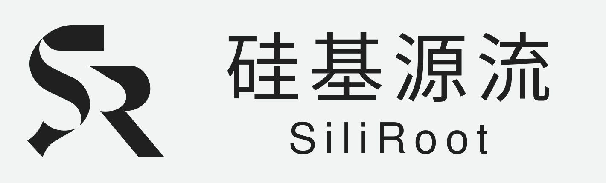
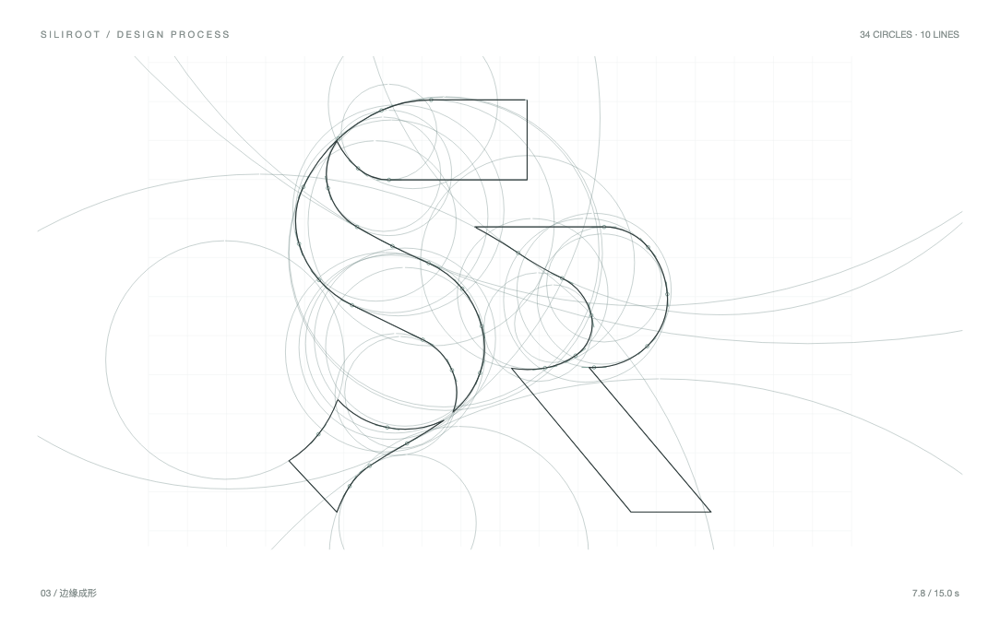

# SiliRoot Logo Design

<p align="center">
  <picture>
    <source media="(prefers-color-scheme: dark)" srcset="assets/logo-readme-dark.svg">
    <source media="(prefers-color-scheme: light)" srcset="assets/logo-readme-light.svg">
    
  </picture>
</p>

SiliRoot（硅基源流）的 Logo 设计衍生小工具前端项目。项目把品牌标志的几何构造过程做成可交互页面，并进一步提供双字母共形实验工具，用标准圆、圆弧、直线和真实负空间生成新的 Monogram 方案。

> “直线属于人类，曲线属于上帝。” —— 安东尼·高迪

## 在线预览

- [Logo Design Lab](https://siliroot.com/logo-lab) — 查看 SR 标志从几何构造到渐进填黑的完整过程
- [双字母设计工具](https://siliroot.com/monogram-mvp/) — 输入两个字母，生成并导出共形 Monogram 方案

## SR 几何构造

<p align="center">
  
</p>

构造线、轮廓动画与最终黑色填充共用同一份封闭几何边界。曲线由标准圆弧构成，水平边、垂直边和斜边由直线构成；交叉处使用区域合并与切除形成真实透明孔洞，不依赖白色遮盖。

## 两个设计工具

### Logo Design Lab

`public/logo-lab.html`

- 以 15 秒动画展示直线定位、构造圆展开、圆弧成形和渐进填黑。
- 可显示参与轮廓的圆、直线、相切接点和测量信息。
- 支持原始设计图对照、透明叠加和差值检查。
- 提供 96 px、48 px 和 32 px 小尺寸效果预览。

### Monogram Tool

`public/monogram-mvp/index.html`

- 支持任意两个 A–Z 大写字母，也支持相同字母组合。
- 提供交错穿插、轮廓熔合、负形嵌入、共轴压合、内外抱合和斜向咬合六种关系。
- 可调整笔画重量、重叠强度和关系张力。
- 动态展示构造圆、直边、封闭轮廓和渐进填黑。
- 可导出透明背景 SVG 和 1280 × 800 PNG。

## 技术实现

- 原生 HTML、CSS、SVG 与 JavaScript
- React + Remotion Player 构建设计过程动画
- 解析式圆／直线求交与封闭区域布尔运算
- SVG 使用 `M / L / A / Z` 路径，不依赖字体描摹或位图轮廓
- 静态资源使用相对路径，可部署在 GitHub Pages 子目录

## 本地运行

需要 Node.js 22+ 与 pnpm。

```bash
pnpm install
pnpm dev
```

打开：

- 项目首页：`http://localhost:4321/`
- Logo Design Lab：`http://localhost:4321/logo-lab.html`
- 双字母设计工具：`http://localhost:4321/monogram-mvp/index.html`

## 构建与测试

```bash
# 重新构建 Remotion 动画与共享几何模块
pnpm build

# 检查 234 组几何配置的闭合轮廓与标准圆弧
pnpm test
```

## 项目结构

```text
assets/                         README 展示资源
public/
  index.html                    项目入口
  logo-lab.html                 SR Logo 几何实验室
  logo-animation.js             Remotion 浏览器构建产物
  logo-geometry.js              共享几何浏览器模块
  monogram-mvp/                 双字母设计工具
src/
  lab/LogoAnimation.tsx         Remotion 动画源码
  lib/logo-geometry.js          SR 共享几何源码
scripts/build-logo-animation.mjs
scripts/build-readme-assets.mjs
```

## 品牌信息

苏州硅基源流人工智能。以 Agent 特区承接 AI 战略，把试点放进有边界的真实工作。

- 公司官网：[siliroot.com](https://siliroot.com/)
- 联系邮箱：[yzw@imcoders.net](mailto:yzw@imcoders.net)
